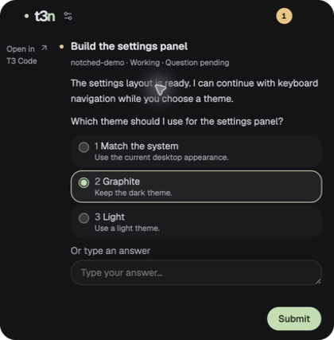

# T3 Code Notched

A small desktop companion for [T3 Code](https://github.com/pingdotgg/t3code).
Keep agent status, replies, and questions at the edge of your screen while you
work in another app.


## Why Notched?

Expand it to read the latest reply, switch threads, or answer an async question.
Drag it to a screen edge or corner. Turn on provider usage to see the remaining
allowance reported by T3.



_Captured from the native macOS app on a MacBook, using sample data._

T3 Code runs your agents. Notched connects to that existing environment. Use T3
for new prompts, approvals, and agent controls. Quitting Notched leaves your
T3 work running.

## Installation

You need a running local **T3 Code** environment (stable or Nightly with compatible
APIs), **Node.js 24.13.1 or
later in the Node 24 series**, and **pnpm 11.19.0**. On macOS, install Xcode
Command Line Tools to build the screen-geometry helper.

### Run from source

```sh
git clone https://github.com/architpai/t3-code-notched.git
cd t3-code-notched
pnpm install --frozen-lockfile
pnpm dev
```

Start T3 Code, expand Notched, and select **Connect local T3**. On macOS, this
finds the Nightly or Alpha app in `/Applications`. T3 can already be running
when Notched starts. For other installations, use a
[pairing code](docs/usage.md#connect-with-a-pairing-code).

### Install the macOS app

```sh
pnpm install:mac
```

This installs **T3 Code Notched.app** in `/Applications` and enables automatic
installation after future builds. Quit and reopen the app to use a new build.
Delete `.local/install-macos` to stop automatic installation.

### Try the interface with sample data

```sh
pnpm demo
```

Open <http://127.0.0.1:5178>. This preview does not connect to T3 or run agents.

## Async questions

When an agent asks a question, Notched opens and keeps it available until you
answer or collapse the panel. Click an option, press **1–9**, or type your own
answer. Press **Enter** or click **Submit** to send it; **Shift+Enter** adds a line.

Question answers are enabled by default for new connections. They require T3
operation access. For a read-only connection, turn off **Allow question answers**
before connecting. Existing connections need a reconnect to apply a change.

[More about questions and answer permissions](docs/usage.md#async-questions).

## Some notes

This project is under development. Expect bugs.

- Native desktop behavior has been tested on **macOS only**. Windows and Linux
  desktop behavior still needs verification.
- Compatible stable and Nightly builds are supported. Read-only monitoring was
  verified with stable **T3 Code 0.0.40**. Async answers need a build with the
  async question API; older builds may support monitoring only. Provider usage
  appears only when T3 supplies it.
- Replies refresh by polling and cover the latest two turns. Open T3 for the
  full conversation. Opening T3 does not select the same thread automatically.
- Connections stay in memory unless you select **Remember securely**. Notched
  uses Electron secure storage for saved tokens. It does not save replies to disk.

## Documentation

- [Connection setup and pairing](docs/usage.md#connect-to-t3-code)
- [Settings and keyboard controls](docs/usage.md#settings-and-controls)
- [Async questions](docs/usage.md#async-questions)
- [Architecture, API references, and limits](docs/architecture.md)

## Development

Run `pnpm check` for type checks, tests, and a production build. If automatic
macOS installation is enabled, this also updates the installed app.

Read [AGENTS.md](AGENTS.md) and [docs/architecture.md](docs/architecture.md)
before making changes. Use a separate T3 environment for tests, and state which
operating systems you tested when reporting a bug or opening a pull request.

## License

[MIT](LICENSE). An independent project, not affiliated with T3 Chat yet ...
