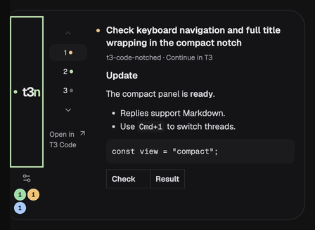
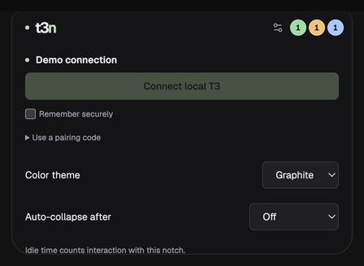

<div align="center">

# T3 Code Notched

**A compact desktop monitor for T3 Code that lives at the edge of your screen.**

See which agent threads are running, which need you, and what they last said —
without switching windows.

[](https://github.com/architpai/t3-code-notched/actions/workflows/ci.yml)


</div>

---

## What it does

T3 Code runs your agents. Notched is a read-only window onto that work, docked to
a screen edge like a notch. It never executes agent work itself, and quitting it
leaves every T3 run going.

|            |                                                                                                      |
| ---------- | ---------------------------------------------------------------------------------------------------- |
| **Glance** | Collapsed, it is a thin bar: one orb per state — working, needs you, done.                           |
| **Read**   | Expanded, it shows the active thread's title, project, and latest agent reply, rendered as Markdown. |
| **Switch** | Number keys, arrow buttons, or `Cmd/Ctrl + 1–9` move between threads.                                |
| **Dock**   | Drag it to any edge or corner. Corners stack vertically and expand inward.                           |
| **Budget** | Optional provider allowance readout — how much of your 5-hour and weekly window is left.             |
| **Act**    | One button: **Open T3 Code**. Approvals, steering, and history stay in T3, where they belong.        |

## Screenshots

<table>
<tr>
<td width="50%">


**Expanded** — thread rail on the left, agent reply on the right. Markdown, code
blocks, and tables render; links, remote images, and raw HTML do not.

</td>
<td width="50%">



**Docked left** — with a header button focused, arrow keys pick an edge and
`Shift+arrow` slides along it. Focus stays visible throughout.

</td>
</tr>
<tr>
<td width="50%">



**Settings** — connect, theme, auto-collapse delay, and the optional provider
usage readout. Tokens stay in memory unless you opt into secure storage.

</td>
<td width="50%">


**Collapsed + usage** — three orbs, then remaining allowance per provider. Hover
for limits, reset times, and when each value was observed.

</td>
</tr>
</table>

> All screenshots come from `pnpm demo`, which runs on clearly marked fixture
> data. No real threads or credentials appear anywhere in this repository.

## Status

This is a work in progress, not a release.

- Native behavior is tested on **macOS only**. Windows and Linux build and pass CI,
  but their native placement is untested — CI success is not proof of native behavior.
- Notched targets **T3 Code Nightly**. Stable can connect, but some features use
  APIs that Stable does not expose yet.
- There are no published binaries. Build it yourself (below).

## Install

Requires **Node 24.13.1+** and **pnpm 11.19.0**. macOS also needs Xcode Command Line
Tools, to compile the display-geometry helper.

```sh
git clone https://github.com/architpai/t3-code-notched.git
cd t3-code-notched
pnpm install --frozen-lockfile
pnpm dev
```

On macOS, `pnpm install:mac` builds and installs **T3 Code Notched.app** into
`/Applications`, and turns on local reinstall after every successful `pnpm build`.
The flag lives in the Git-ignored `.local/install-macos`; delete that file to stop.
A running app must be quit and reopened to pick up a new build.

Want to look before you build? `pnpm demo` opens a browser preview on fixture data.
It cannot connect to T3.

## Connect

Open T3 Code, expand the panel, and choose **Connect local T3**. Automatic pairing
covers the standard macOS installation.

For other platforms or a custom install, mint a pairing credential with T3's CLI:

```sh
t3 auth pairing create --base-dir /path/to/t3-home --ttl 5m --label "T3 Code Notched" --json
```

Enter the local HTTP origin and the returned `credential` under **Use a pairing code**.

Notched asks for `orchestration:read` and nothing else. Access is scoped to the
environment, not a single project. Tokens stay in memory unless you tick **Remember
securely**, which uses Electron `safeStorage`; Linux's unprotected `basic_text`
backend is refused rather than silently accepted. Disconnect deletes the saved
token. To revoke server access, revoke the Notched session inside T3.

A stale connection disables controls and hides reply text, so a frozen panel never
looks like a live one.

## Keyboard

| Shortcut                   | Action                       |
| -------------------------- | ---------------------------- |
| `Cmd/Ctrl + Shift + Space` | Show or hide the panel       |
| `Esc`                      | Collapse                     |
| `Cmd/Ctrl + 1`–`9`         | Jump to thread 1–9           |
| `Arrow` (header focused)   | Choose a screen edge         |
| `Shift + Arrow`            | Slide along the current edge |

## Design limits

These are deliberate, not missing features.

- **Read-only.** T3 owns approvals, settlement, and every agent control. Notched
  does not resend uncertain messages, and command acceptance is never treated as
  provider success.
- **Bounded reads.** Replies cover the latest two turns. The selected thread plus
  two active threads refresh per cycle, so large queues cycle slowly by design
  rather than bulk-reading transcripts.
- **Nothing on disk.** Replies are never written to disk. Use T3 for full history.
- **No exact-run steering.** Interrupt and steer stay hidden until the upstream
  contract preserves the requested run identity.
- **Providers are data.** A new provider is a config entry, not a new class hierarchy.

Accessibility is a requirement, not an extra: visible focus, real labels, icons
instead of emoji, reduced-motion support, and no continuous animation.

## Development

| Command             | Purpose                                                   |
| ------------------- | --------------------------------------------------------- |
| `pnpm dev`          | Run the desktop app in development                        |
| `pnpm demo`         | Browser preview on marked fixture data; no live T3 access |
| `pnpm check`        | Type check, tests, and production build                   |
| `pnpm format:check` | Formatting check                                          |
| `pnpm build`        | Build the desktop app                                     |
| `pnpm start`        | Open the production build                                 |
| `pnpm dist`         | Package for the build host                                |

Tests cover connection validation, read-only access, environment binding,
cancellation, bounded replies, status mapping, placement, usage parsing, and
notifications. CI runs on macOS, Windows, and Linux; it publishes nothing.

Two macOS checks are manual. For full-screen placement, run
`swift scripts/check-macos-space.swift Electron` while another app is full screen.
For motion, close the development app and start an isolated, disconnected instance:

```sh
pnpm dev --user-data-dir=/tmp/notched-motion-check --remote-debugging-port=9234
# In another terminal:
node scripts/check-macos-motion.mjs
```

Local captures and investigation notes belong in `.local/`, which Git ignores.

## Contributing

Read [`docs/architecture.md`](docs/architecture.md) first — it records the module
boundaries and why each limit above exists. The short version: keep TypeScript
strict, validate everything crossing the network and IPC boundary, keep
provider-specific logic out of React, and read the callers before changing a
contract.

Never point a development server at `~/.t3/userdata`, edit a live T3 database, or
copy provider credentials. Use a separate base directory for isolated tests.

Run `pnpm check` before opening a pull request, and say which operating systems you
actually tested on.

## License

MIT — see [`LICENSE`](LICENSE).

---

<div align="center">
<sub>Not affiliated with T3 Chat or T3 Tools. Built on the T3 Code orchestration API.</sub>
</div>
